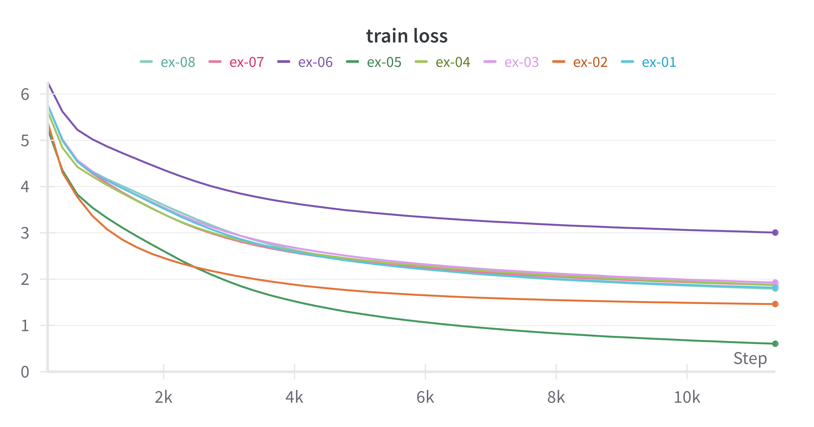
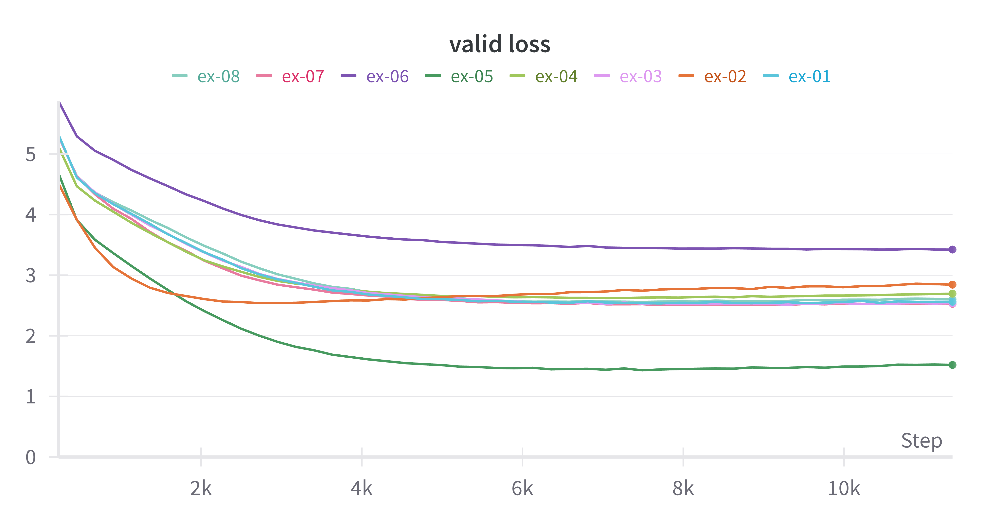
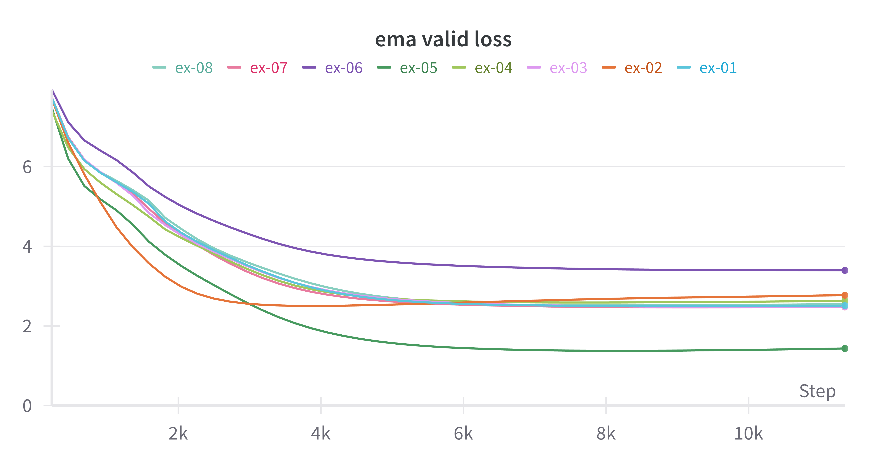
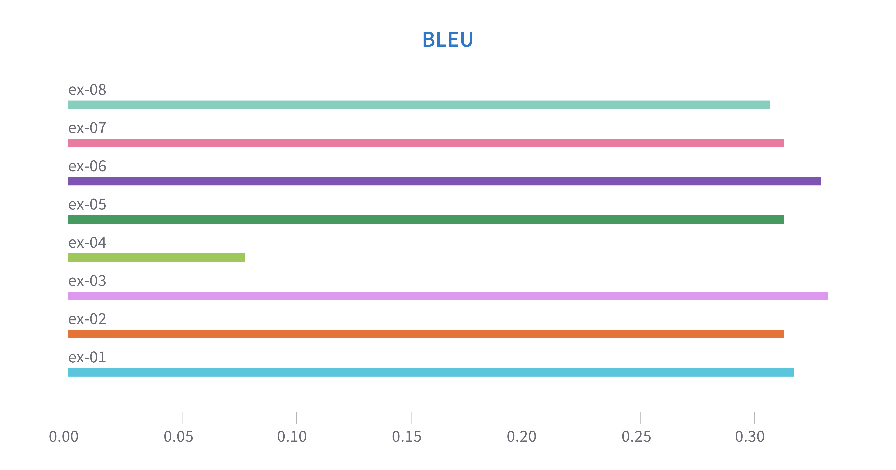
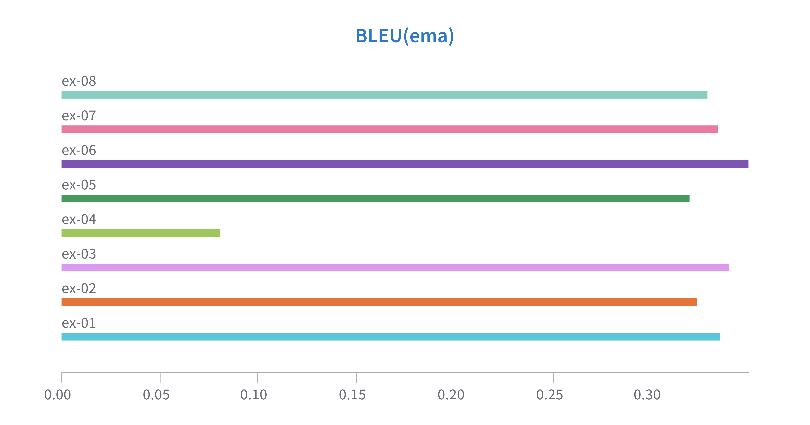
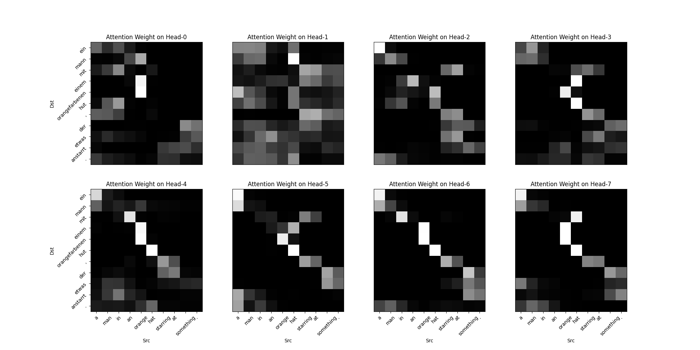

Transformer Study
==

## Introduction
- This is a personal repository for studying the Transformer model (“Attention Is All You Need”).
    - This includes minor experiments.
- Due to computing resource limitations, a smaller dataset (“Multi30K”) and a smaller model size are used compared to the original paper.
- `spacy` and `torchtext` libraries are utilized to generate tokens and vocabulary.

## Usage
- Requirements
    - torch (v2.3.0)
    - torchtext
    - datasets
    - scapy
    - wandb (optional)

To use tokenizer of `spacy`, it need to download the language pipeline manually.
```bash
python -m spacy download en_core_web_sm
python -m spacy download de_core_news_sm
```

## Result
### Experimental Setup
- Dataset: Multi30K
- Vocaburary Size: English 5,893 toekens, German 7,853 tokens.
    - Make vocaburary with minimum freqeunce of 2. 
- Model
    - `d_model`=256, `d_ff`=512, `n_layers`=3, `n_heads`=8
        - Number of model parameters: ~9M
    - `residual_drop`=0.1, `embedding_drop`=0.1. `attention_drop`=0.0
        - In the paper, they don't use dropout on attention weight, but now it is common.
- Training: `batch_size`=128, `optimization`='AdamW', `lr`=0.0005, `weight_decay`=5e-4, `label_smoothing`=0.1
- I used EMA(Exponential Moving Average) of model weights additionally.
- For further details, see default arguments in [`config.py`](./config.py).
 
### Experimental Results
- Base Model: `ex-01`
- Use embedding vector instead of sinusoidal positional encoding: `ex-02`
- Dropout on attention weight: `ex-03`
- German to English translation: `ex-04`
- Don't use label smoothing: `ex-05`
- Increase label smoothness: `ex-06`
- Adjust number of heads: `ex-07`(8 -> 4), `ex-08`(8 -> 16)

#### Training losses
| Train loss | Validation loss | Validation loss (ema) |
| --- | --- | --- | 
|  | |  |
- BLEU Score is calculated with the best validation loss model and the ema model.

#### BLEU Scores
| BLEU Score (best valid model) | BLEU Score (ema) |
| --- | --- |
|  |  |

**See live charts in wandb [project](https://api.wandb.ai/links/minssi/amg8eo8r).**

#### Sentence Samples
```text
# English to German (ex-01~03)
Ground Truth: ein mann mit einem orangefarbenen hut , der etwas anstarrt .

ex-01(best val): ein mann mit einem orangefarbenen hut starrt etwas an .
ex-01(ema): ein mann mit orangefarbener mütze starrt auf etwas .

ex-02(best val): ein mann mit einem orangefarbenen hut starrt etwas an .
ex-02(ema): ein mann mit einem orangefarbenen hut starrt auf etwas zu .

ex-03(best val): ein mann mit einem orangefarbenen hut starrt auf etwas .
ex-03(ema): ein mann mit einem orangefarbenen hut starrt auf etwas .

# German to English (ex-04)
Ground Truth: a man in an orange hat starring at something .
ex-04(best val): <unk> with an orange plastic <unk> <unk> something .
ex-04(ema): <unk> with an orange <unk> cutting something to something .
```

#### Attention Weights (model: `ex-01`)


## To Do
- [ ] Analysis of `ex-04`'s low BLEU Score
- [ ] English-to-Spanish translation task
    - [dataset](https://keras.io/examples/nlp/neural_machine_translation_with_transformer/)
    - [tokenizer](https://spacy.io/models/es)

## Reference
- [Multi30K](https://hal.science/hal-02008843/file/WMT029.pdf)
- https://github.com/hyunwoongko/transformer
- https://github.com/ndb796/Deep-Learning-Paper-Review-and-Practice
- [Attention dropout, where was it proposed/used first?](https://stats.stackexchange.com/questions/509798/attention-dropout-where-was-it-proposed-used-first)
